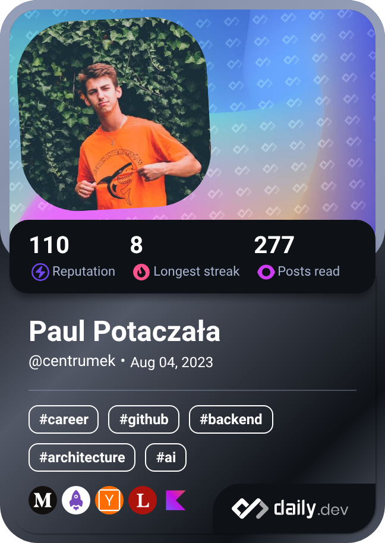

# Heeeeeello! 👋

----

    

<table>
  <tbody>
    <tr>
      <td align="center" width="70%" colspan="2">
        
        
        
      </td>
      <td width="30%" rowspan="2">
        
      </td>
    </tr>
  </tbody>
</table>

---

## Play with me on [Chess.com](https://www.chess.com/member/centrumek)

<!--START_SECTION:chessStats-->
<!-- Automatically generated with https://github.com/Balastrong/chess-stats-action -->

| Type | Rapid ⏲️ | Blitz ⚡ | Bullet 🔫 |
|:---:|:---:|:---:|:---:|
| Current | 1000 | 1068 | 1317 |
| Best | 1132 | 1220 | 1317 |

| White ⚪ | Black ⚫ | Result 🏆 | Date 📅 | Position 🗺️ | Type 🕕 |
|:---:|:---:|:---:|:---:|:---:|:---:|
| Leah309 | **centrumek** | abandoned  | 18/1/2026 | <a href="http://www.ee.unb.ca/cgi-bin/tervo/fen.pl?select=6Q1/5k1K/8/8/8/8/8/8 b - - 0 57">Link</a> | Blitz |
| **centrumek** | Zovazova | win 🥇 | 18/1/2026 | <a href="http://www.ee.unb.ca/cgi-bin/tervo/fen.pl?select=8/Q4qkR/1p4n1/5p2/3P4/1P6/2P5/2K3R1 b - - 0 31">Link</a> | Blitz |
| giadobiac | **centrumek** | win 🥇 | 18/1/2026 | <a href="http://www.ee.unb.ca/cgi-bin/tervo/fen.pl?select=2k2r2/ppp5/2np3b/4p2p/4Q1rB/3P2P1/PPP4P/R3KN1q b Q - 3 22">Link</a> | Blitz |
| flominet | **centrumek** | abandoned  | 18/1/2026 | <a href="http://www.ee.unb.ca/cgi-bin/tervo/fen.pl?select=8/8/PK6/2P5/8/1R6/3k4/8 b - - 0 59">Link</a> | Blitz |
| Saidbus2 | **centrumek** | abandoned  | 18/1/2026 | <a href="http://www.ee.unb.ca/cgi-bin/tervo/fen.pl?select=2r5/pp3k2/3p4/4R1p1/6P1/1B5P/P4PK1/3R4 b - - 0 30">Link</a> | Blitz |

<!--END_SECTION:chessStats-->

## Learn languages with me on [Duolingo.com](https://www.duolingo.com/profile/Centrumek)

<!--START_SECTION:duolingoStats-->
<!-- Automatically generated with https://github.com/centrumek/duolingo-readme-stats-->

| Username | Day Streak | Total XP |
|:---:|:---:|:---:|
|  Centrumek |  974 |  37698 |

| Language | XP |
|:---:|:---:|
|  Spanish |  16886 |
|  Ukrainian |  15423 |
|  Japanese |  5354 |

<!--END_SECTION:duolingoStats-->

<!--
**centrumek/centrumek** is a ✨ _special_ ✨ repository because its `README.md` (this file) appears on your GitHub profile.

Here are some ideas to get you started:

- 🔭 I’m currently working on ...
- 🌱 I’m currently learning ...
- 👯 I’m looking to collaborate on ...
- 🤔 I’m looking for help with ...
- 💬 Ask me about ...
- 📫 How to reach me: ...
- 😄 Pronouns: ...
- ⚡ Fun fact: ...
-->
