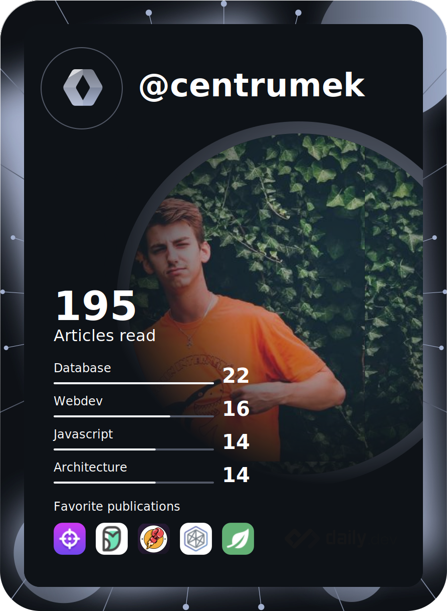

<h1>
  
  Welcome to my world!
</h1>

<table>
  <tbody>
    <tr>
      <td align="center" width="70%" colspan="2">
        <h2>
          
          I'm Paul Potaczała
        </h2>
        <h4>
          Harmonious Software Engineer finding the consciousness and peace among time units.
           
          I talk about Tech, Self-Development and Well-Being. 🌿🧘🚀
        </h4>
      </td>
      <td width="30%" rowspan="2">
        
      </td>
    </tr>
    <tr align="center">
      <td>
        
      </td>
      <td>
        
      </td>
    </tr>
  </tbody>
</table>

---

  
  
  
   
   
  

---

## Play with me on [Chess.com](https://www.chess.com/member/centrumek)

<!--START_SECTION:chessStats-->
<!-- Automatically generated with https://github.com/Balastrong/chess-stats-action -->

| Type | Rapid ⏲️ | Blitz ⚡ | Bullet 🔫 |
|:---:|:---:|:---:|:---:|
| Current | 1000 | 1071 | 1165 |
| Best | 1132 | 1098 | 1266 |

| White ⚪ | Black ⚫ | Result 🏆 | Date 📅 | Position 🗺️ | Type 🕕 |
|:---:|:---:|:---:|:---:|:---:|:---:|
| ahkama | **centrumek** | win 🥇 | 30/9/2025 | <a href="http://www.ee.unb.ca/cgi-bin/tervo/fen.pl?select=3R4/5kr1/p7/2B5/3P1n2/P6P/5PPK/5q2 w - - 7 41">Link</a> | Blitz |
| Vladandslav | **centrumek** | win 🥇 | 30/9/2025 | <a href="http://www.ee.unb.ca/cgi-bin/tervo/fen.pl?select=8/8/8/p6p/7P/1P2k1p1/K5P1/3q4 b - - 1 52">Link</a> | Blitz |
| **centrumek** | Skillsdeveloper | win 🥇 | 30/9/2025 | <a href="http://www.ee.unb.ca/cgi-bin/tervo/fen.pl?select=8/2Q3pk/4p2B/4P3/4n3/P2K2P1/2P4P/1q6 b - - 4 42">Link</a> | Blitz |
| mikey470 | **centrumek** | win 🥇 | 30/9/2025 | <a href="http://www.ee.unb.ca/cgi-bin/tervo/fen.pl?select=rn1k4/ppp5/6BB/3Np2P/3b4/8/PPP2qP1/R2R1K2 w - - 1 22">Link</a> | Blitz |
| KANYECH3SH | **centrumek** | timeout ❌ | 30/9/2025 | <a href="http://www.ee.unb.ca/cgi-bin/tervo/fen.pl?select=8/7R/4K3/2B5/3Q2k1/8/8/8 b - - 0 47">Link</a> | Blitz |
| **centrumek** | PapaVLax | win 🥇 | 30/9/2025 | <a href="http://www.ee.unb.ca/cgi-bin/tervo/fen.pl?select=8/8/8/8/4Q3/2B2R1k/5P2/6K1 b - - 6 65">Link</a> | Blitz |
| **centrumek** | Jorge1956 | win 🥇 | 30/9/2025 | <a href="http://www.ee.unb.ca/cgi-bin/tervo/fen.pl?select=6r1/1p6/p4R1q/2p4k/2P5/PP1p3K/1B2n3/7R b - - 0 37">Link</a> | Blitz |
| **centrumek** | unknownstatus06 | abandoned  | 30/9/2025 | <a href="http://www.ee.unb.ca/cgi-bin/tervo/fen.pl?select=7k/ppp3pp/1b6/1P6/P3q3/B5P1/2P4P/RK6 w - - 0 30">Link</a> | Blitz |
| Insane_Chess_101 | **centrumek** | win 🥇 | 30/9/2025 | <a href="http://www.ee.unb.ca/cgi-bin/tervo/fen.pl?select=8/3k4/3p4/p2Pr2p/2P4P/R4P2/P4r2/1K5R w - - 8 38">Link</a> | Blitz |
| naserrafizade | **centrumek** | checkmated ❌ | 29/9/2025 | <a href="http://www.ee.unb.ca/cgi-bin/tervo/fen.pl?select=3k4/3Q4/3R1p2/pPpP4/P1P1ppP1/2P2P2/6K1/8 b - - 0 52">Link</a> | Blitz |

<!--END_SECTION:chessStats-->

## Learn languages with me on [Duolingo.com](https://www.duolingo.com/profile/Centrumek)

<!--START_SECTION:duolingoStats-->
<!-- Automatically generated with https://github.com/centrumek/duolingo-readme-stats-->

| Username | Day Streak | Total XP |
|:---:|:---:|:---:|
|  Centrumek |  881 |  36265 |

| Language | XP |
|:---:|:---:|
|  Spanish |  16055 |
|  Ukrainian |  14821 |
|  Japanese |  5354 |

<!--END_SECTION:duolingoStats-->

<!--
**centrumek/centrumek** is a ✨ _special_ ✨ repository because its `README.md` (this file) appears on your GitHub profile.

Here are some ideas to get you started:

- 🔭 I’m currently working on ...
- 🌱 I’m currently learning ...
- 👯 I’m looking to collaborate on ...
- 🤔 I’m looking for help with ...
- 💬 Ask me about ...
- 📫 How to reach me: ...
- 😄 Pronouns: ...
- ⚡ Fun fact: ...
-->
