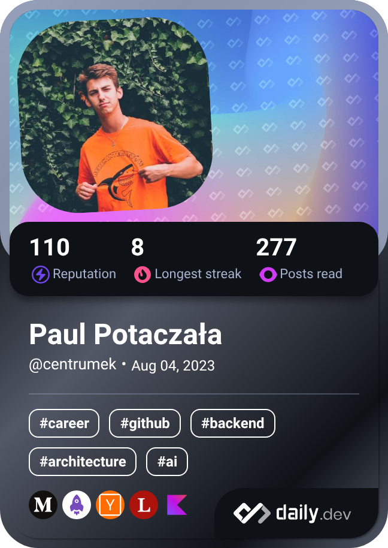

# Heeeeeello! 👋

----

    

<table>
  <tbody>
    <tr>
      <td align="center" width="70%" colspan="2">
        
        
        
      </td>
      <td width="30%" rowspan="2">
        
      </td>
    </tr>
  </tbody>
</table>

---

## Play with me on [Chess.com](https://www.chess.com/member/centrumek)

<!--START_SECTION:chessStats-->
<!-- Automatically generated with https://github.com/Balastrong/chess-stats-action -->

| Type | Rapid ⏲️ | Blitz ⚡ | Bullet 🔫 |
|:---:|:---:|:---:|:---:|
| Current | 1106 | 1067 | 1317 |
| Best | 1132 | 1220 | 1317 |

| White ⚪ | Black ⚫ | Result 🏆 | Date 📅 | Position 🗺️ | Type 🕕 |
|:---:|:---:|:---:|:---:|:---:|:---:|
| **centrumek** | leariva | win 🥇 | 19/4/2026 | <a href="http://www.ee.unb.ca/cgi-bin/tervo/fen.pl?select=8/2B4p/p3k1p1/1pp2p2/8/2P1N2P/P5P1/7K b - - 1 42">Link</a> | Blitz |
| Dr_BluePentagon | **centrumek** | resigned ❌ | 19/4/2026 | <a href="http://www.ee.unb.ca/cgi-bin/tervo/fen.pl?select=8/1PR5/8/8/5PP1/pk2p3/3pK3/3R4 b - - 0 44">Link</a> | Blitz |
| **centrumek** | punpunpuna | win 🥇 | 19/4/2026 | <a href="http://www.ee.unb.ca/cgi-bin/tervo/fen.pl?select=r1r5/pRp4p/P1P2PkR/3Pp1P1/4P1K1/5P2/8/8 b - - 4 51">Link</a> | Blitz |
| DYNAN89 | **centrumek** | timeout ❌ | 19/4/2026 | <a href="http://www.ee.unb.ca/cgi-bin/tervo/fen.pl?select=6k1/R7/p7/3P3p/2r5/1K3P1P/8/8 b - - 2 40">Link</a> | Blitz |
| **centrumek** | rylerussell | win 🥇 | 19/4/2026 | <a href="http://www.ee.unb.ca/cgi-bin/tervo/fen.pl?select=1k2R3/6pp/PBp5/2KP4/7r/8/2P5/8 b - - 2 38">Link</a> | Blitz |

<!--END_SECTION:chessStats-->

## Learn languages with me on [Duolingo.com](https://www.duolingo.com/profile/Centrumek)

<!--START_SECTION:duolingoStats-->
<!-- Automatically generated with https://github.com/centrumek/duolingo-readme-stats-->

| Username | Day Streak | Total XP |
|:---:|:---:|:---:|
|  Centrumek |  1005 |  38055 |

| Language | XP |
|:---:|:---:|
|  Spanish |  16983 |
|  Ukrainian |  15683 |
|  Japanese |  5354 |

<!--END_SECTION:duolingoStats-->

<!--
**centrumek/centrumek** is a ✨ _special_ ✨ repository because its `README.md` (this file) appears on your GitHub profile.

Here are some ideas to get you started:

- 🔭 I’m currently working on ...
- 🌱 I’m currently learning ...
- 👯 I’m looking to collaborate on ...
- 🤔 I’m looking for help with ...
- 💬 Ask me about ...
- 📫 How to reach me: ...
- 😄 Pronouns: ...
- ⚡ Fun fact: ...
-->
