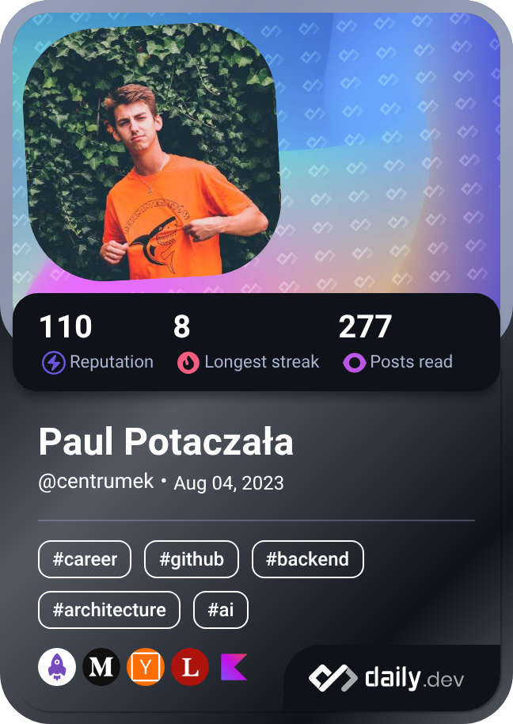

# Heeeeeello! 👋

----

    

<table>
  <tbody>
    <tr>
      <td align="center" width="70%" colspan="2">
        
        
        
      </td>
      <td width="30%" rowspan="2">
        
      </td>
    </tr>
  </tbody>
</table>

---

## Play with me on [Chess.com](https://www.chess.com/member/centrumek)

<!--START_SECTION:chessStats-->
<!-- Automatically generated with https://github.com/Balastrong/chess-stats-action -->

| Type | Rapid ⏲️ | Blitz ⚡ | Bullet 🔫 |
|:---:|:---:|:---:|:---:|
| Current | 1049 | 876 | 1369 |
| Best | 1132 | 1220 | 1369 |

| White ⚪ | Black ⚫ | Result 🏆 | Date 📅 | Position 🗺️ | Type 🕕 |
|:---:|:---:|:---:|:---:|:---:|:---:|
| **centrumek** | chs232 | timeout ❌ | 28/8/2026 | <a href="http://www.ee.unb.ca/cgi-bin/tervo/fen.pl?select=7r/4rpb1/p1k3p1/3p3p/1Pp5/P4B1P/8/1K1R4 w - - 0 33">Link</a> | Blitz |
| erms063 | **centrumek** | timeout ❌ | 26/8/2026 | <a href="http://www.ee.unb.ca/cgi-bin/tervo/fen.pl?select=1r6/2pN4/1k6/6p1/3p1p2/3P1B1P/5PP1/6K1 b - - 3 41">Link</a> | Blitz |
| **centrumek** | dobrinyordanov | timevsinsufficient ⏸️ | 25/8/2026 | <a href="http://www.ee.unb.ca/cgi-bin/tervo/fen.pl?select=8/8/3k4/8/8/1Q5P/4K3/2Q5 w - - 2 68">Link</a> | Blitz |
| rafa-alba | **centrumek** | abandoned  | 23/8/2026 | <a href="http://www.ee.unb.ca/cgi-bin/tervo/fen.pl?select=8/7p/5Q2/2pPp3/2P2kq1/1P1P4/5PP1/5RK1 b - - 2 38">Link</a> | Blitz |
| **centrumek** | rafa-alba | timevsinsufficient ⏸️ | 23/8/2026 | <a href="http://www.ee.unb.ca/cgi-bin/tervo/fen.pl?select=8/8/6k1/4R3/4KB2/8/8/8 w - - 31 80">Link</a> | Blitz |

<!--END_SECTION:chessStats-->

## Learn languages with me on [Duolingo.com](https://www.duolingo.com/profile/Centrumek)

<!--START_SECTION:duolingoStats-->
<!-- Automatically generated with https://github.com/centrumek/duolingo-readme-stats-->

| Username | Day Streak | Total XP |
|:---:|:---:|:---:|
|  Centrumek |  1005 |  38055 |

| Language | XP |
|:---:|:---:|
|  Spanish |  16983 |
|  Ukrainian |  15683 |
|  Japanese |  5354 |

<!--END_SECTION:duolingoStats-->

<!--
**centrumek/centrumek** is a ✨ _special_ ✨ repository because its `README.md` (this file) appears on your GitHub profile.

Here are some ideas to get you started:

- 🔭 I’m currently working on ...
- 🌱 I’m currently learning ...
- 👯 I’m looking to collaborate on ...
- 🤔 I’m looking for help with ...
- 💬 Ask me about ...
- 📫 How to reach me: ...
- 😄 Pronouns: ...
- ⚡ Fun fact: ...
-->
