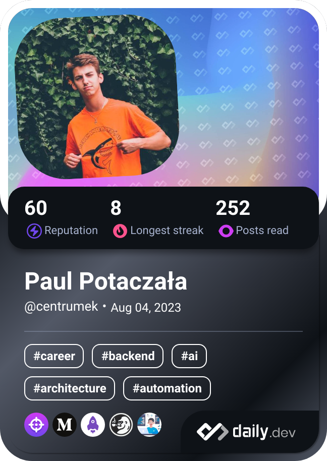

<h1>
  
  Welcome to my world!
</h1>

<table>
  <tbody>
    <tr>
      <td align="center" width="70%" colspan="2">
        <h2>
          
          I'm Paul Potaczała
        </h2>
        <h4>
          Harmonious Software Engineer finding the consciousness and peace among time units.
           
          I talk about Tech, Self-Development and Well-Being. 🌿🧘🚀
        </h4>
      </td>
      <td width="30%" rowspan="2">
        
      </td>
    </tr>
    <tr align="center">
      <td>
        
      </td>
      <td>
        
      </td>
    </tr>
  </tbody>
</table>

---

  
  
  
   
   
  

---

## Play with me on [Chess.com](https://www.chess.com/member/centrumek)

<!--START_SECTION:chessStats-->
<!-- Automatically generated with https://github.com/Balastrong/chess-stats-action -->

| Type | Rapid ⏲️ | Blitz ⚡ | Bullet 🔫 |
|:---:|:---:|:---:|:---:|
| Current | 947 | 766 | 815 |
| Best | 1132 | 910 | 821 |

| White ⚪ | Black ⚫ | Result 🏆 | Date 📅 | Position 🗺️ | Type 🕕 |
|:---:|:---:|:---:|:---:|:---:|:---:|
| daddy_dugg | **centrumek** | insufficient ⏸️ | 30/9/2023 | <a href="http://www.ee.unb.ca/cgi-bin/tervo/fen.pl?select=8/4k3/8/5K2/8/8/8/8 b - -">Link</a> | Blitz |
| pmckella | **centrumek** | timeout ❌ | 30/9/2023 | <a href="http://www.ee.unb.ca/cgi-bin/tervo/fen.pl?select=r7/8/8/8/2KP2R1/2PR4/3k4/8 b - -">Link</a> | Blitz |
| **centrumek** | ha_magniv | resigned ❌ | 30/9/2023 | <a href="http://www.ee.unb.ca/cgi-bin/tervo/fen.pl?select=2k5/1pp4p/p3R1p1/8/6r1/8/5R1P/3r3K w - -">Link</a> | Blitz |
| johannajeip | **centrumek** | resigned ❌ | 30/9/2023 | <a href="http://www.ee.unb.ca/cgi-bin/tervo/fen.pl?select=6Q1/pp6/5P2/8/1k2N2P/1P6/6PK/8 b - -">Link</a> | Blitz |
| **centrumek** | Erki2 | win 🥇 | 30/9/2023 | <a href="http://www.ee.unb.ca/cgi-bin/tervo/fen.pl?select=5r1k/1p4Q1/3p1P2/p1p1p3/P7/BP4P1/2P5/2K5 b - -">Link</a> | Blitz |
| Bassman1961 | **centrumek** | checkmated ❌ | 30/9/2023 | <a href="http://www.ee.unb.ca/cgi-bin/tervo/fen.pl?select=7r/1rpb1p2/p1p1k2p/2B1P1p1/2PN2nP/8/P1P3P1/2KRR3 b - -">Link</a> | Blitz |
| **centrumek** | Killa_Bean | win 🥇 | 29/9/2023 | <a href="http://www.ee.unb.ca/cgi-bin/tervo/fen.pl?select=6r1/1Q2R2p/pk3B1r/8/1Pq5/P7/2P2P1P/3R3K b - -">Link</a> | Blitz |
| Easysniper25 | **centrumek** | timevsinsufficient ⏸️ | 29/9/2023 | <a href="http://www.ee.unb.ca/cgi-bin/tervo/fen.pl?select=3Q4/8/8/3N1K2/3k4/8/8/8 w - -">Link</a> | Blitz |
| **centrumek** | El_Qady | resigned ❌ | 29/9/2023 | <a href="http://www.ee.unb.ca/cgi-bin/tervo/fen.pl?select=r7/3nk1pp/4pp2/p2p4/3P3N/4P3/4KPPP/2r5 w - -">Link</a> | Blitz |
| Ranu_S | **centrumek** | checkmated ❌ | 29/9/2023 | <a href="http://www.ee.unb.ca/cgi-bin/tervo/fen.pl?select=r5nk/3R3Q/p5p1/2P2p2/4pq2/1PP5/2n2PPP/5RK1 b - -">Link</a> | Blitz |

<!--END_SECTION:chessStats-->

## Learn languages with me on [Duolingo.com](https://www.duolingo.com/profile/Centrumek)

<!--START_SECTION:duolingoStats-->
<!-- Automatically generated with https://github.com/centrumek/duolingo-readme-stats-->

| Username | Day Streak | Total XP |
|:---:|:---:|:---:|
| 👤 Centrumek | 🔥 267 | ⚡ 24120 |

| Language | Level | XP |
|:---:|:---:|:---:|
| 🇺🇦 Ukrainian | 👑 36 | ⚡ 9111 |
| 🇪🇸 Spanish | 👑 76 | ⚡ 10202 |
| 🇯🇵 Japanese | 👑 9 | ⚡ 4807 |

<!--END_SECTION:duolingoStats-->

<!--
**centrumek/centrumek** is a ✨ _special_ ✨ repository because its `README.md` (this file) appears on your GitHub profile.

Here are some ideas to get you started:

- 🔭 I’m currently working on ...
- 🌱 I’m currently learning ...
- 👯 I’m looking to collaborate on ...
- 🤔 I’m looking for help with ...
- 💬 Ask me about ...
- 📫 How to reach me: ...
- 😄 Pronouns: ...
- ⚡ Fun fact: ...
-->
